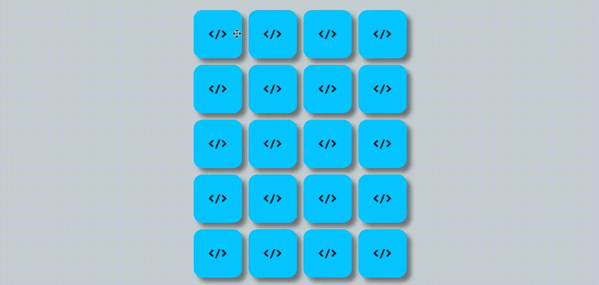

## Sobre o projeto

Projeto desenvolvido no curso [programadorBR](https://programadorbr.com/) com o objetivo de fixar conhecimentos de javascript.

## Tecnologias utilizadas

- [Javascript](https://developer.mozilla.org/en-US/docs/Web/JavaScript)
- [HTML](https://developer.mozilla.org/en-US/docs/Web/HTML)
- [CSS](https://developer.mozilla.org/en-US/docs/Web/CSS)

Feito com ❣️ por Fabricio Ignacio de Espindola